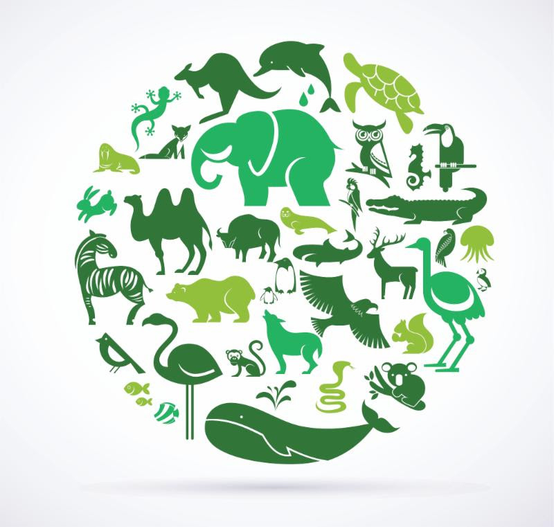

# Project-Oliphant-Abstract

## Background

This repository serves as an abstract of the private Project-Oliphant repository in order to provide a very brief overview of our work.  This project was made possible through collaboration with a nonprofit organization.  Due to the sensitive nature of the dataset provided by the NPO, my team was required to sign non-disclouse agreements.  The main goal of Project-Oliphant was to use machine learning and analytical tools on a high-dimensional dataset in order to assist in the prevention elephant poaching. We were only granted permission by the NPO to present a summary of our findings to a few select audiences in March and April 2019, including on Earth Day.

